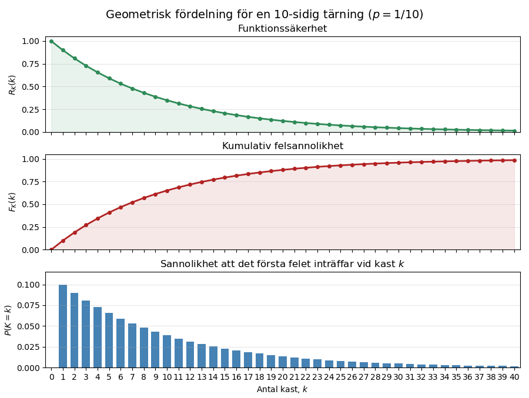

# Tid till fel för icke-reparerbara enheter
För en icke-reparerbar enhet är **tiden till fel** den centrala storheten. När felet har inträffat tas enheten ur populationen som analyseras och inga efterföljande fel eller reparationer ingår inte i modellen.

Låt $TTF$ beteckna tiden till fel. Eftersom det inte går att förutsäga exakt när en viss enhet kommer att sluta fungera modelleras (TTF) som en stokastisk variabel. En observerad livslängd är en realisation av denna variabel.

För att illustrera hur slumpmässiga händelser beter sig börjar vi med ett diskret exempel med en tärning.

## Ett diskret exempel med en tärning
Anta att en enhets funktionstillstånd kontrolleras med jämna tidsintervall. Vid varje kontroll kastas en tiosidig tärning:
- utfallet $1$ betyder att enheten får ett fel,
- övriga utfall betyder att enheten fortsätter att fungera.

Sannolikheten för fel vid varje kontroll är därför

$$
p=\frac{1}{10}=0{,}1.
$$

Det innebär att felsannolikheten är 10 procent vid varje kontroll. Kasten är oberoende av varandra, så resultatet från ett tidigare kast påverkar inte nästa kast.

Låt $K$ beteckna antalet kast fram till och med det första felet. Eftersom felsannolikheten är densamma vid varje kast är $K$ geometriskt fördelad.

För att det första felet ska inträffa vid exempelvis kast 3 måste enheten först klara två kast och därefter få ett fel vid det tredje kastet. På samma sätt måste enheten klara de första $k-1$ kasten för att det första felet ska inträffa vid kast $k$.

Sannolikheten för detta är

$$
f_K(k)=P(K=k)=(1-p)^{k-1}p,
\qquad
k=1,2,\ldots
$$

Funktionssäkerheten beskriver sannolikheten att enheten fortfarande fungerar efter ett visst antal kast. För att enheten ska fungera efter $k$ kast måste den ha klarat samtliga kast:

$$
R_K(k)=P(K>k)=(1-p)^k.
$$

Felsannolikheten beskriver i stället sannolikheten att det första felet har inträffat senast vid kast $k$:

$$
F_K(k)=P(K\leq k)=1-(1-p)^k.
$$

Funktionssäkerheten och felsannolikheten kompletterar varandra:

$$
F_K(k)=1-R_K(k).
$$

Sannolikheten för att det första felet inträffar vid exakt kast $k$ är förändringen i den samlade felsannolikheten mellan kast $k-1$ och kast $k$:

$$
f_K(k)
=
F_K(k)-F_K(k-1)
=
\Delta F_K(k).
$$

Om sannolikheterna för fel vid varje enskilt kast summeras får man sannolikheten att ett fel har inträffat senast vid kast $k$:

$$
F_K(k)=\sum_{i=1}^{k}f_K(i).
$$

De tre funktionerna beskriver alltså olika saker:

- $R_K(k)$ är sannolikheten att enheten fortfarande fungerar efter $k$ kast.
- $F_K(k)$ är sannolikheten att enheten har fått sitt första fel senast vid kast $k$.
- $f_K(k)$ är sannolikheten att det första felet inträffar vid exakt kast $k$.

Före den första kontrollen, när $k=0$, fungerar enheten fortfarande. Därför är $R_K(0)=1$ och $F_K(0)=0$.

Felsannolikheten vid nästa kontroll är alltid 10 procent för en enhet som fortfarande fungerar. Sannolikheten $f_K(k)$ minskar ändå med antalet kast, eftersom färre enheter klarar sig tillräckligt länge för att få sitt första fel vid ett sent kast.


| Kast $k$ | $P(\text{fel})$ | $P(\text{inget fel})$ | $R_K(k)$ | $F_K(k)$ | $f_K(k)$ |
| ---------: | ------------------: | --------------------------: | -----------------: | ------------------: | -------------------------: |
|          1 |               0,100 |                       0,900 |              0,900 |               0,100 |                      0,100 |
|          2 |               0,100 |                       0,900 |              0,810 |               0,190 |                      0,090 |
|          3 |               0,100 |                       0,900 |              0,729 |               0,271 |                      0,081 |
|          4 |               0,100 |                       0,900 |              0,656 |               0,344 |                      0,073 |
|          5 |               0,100 |                       0,900 |              0,590 |               0,410 |                      0,066 |
|          6 |               0,100 |                       0,900 |              0,531 |               0,469 |                      0,059 |
|          7 |               0,100 |                       0,900 |              0,478 |               0,522 |                      0,053 |
|          8 |               0,100 |                       0,900 |              0,430 |               0,570 |                      0,048 |
|          9 |               0,100 |                       0,900 |              0,387 |               0,613 |                      0,043 |
|         10 |               0,100 |                       0,900 |              0,349 |               0,651 |                      0,039 |
|         $\ldots$ |               $\ldots$ |                       $\ldots$ |              $\ldots$ |               $\ldots$ |                      $\ldots$ |
|         40 |               0,100 |                       0,900 |              0,015 |               0,985 |                      0,002 |





Det förväntade antalet kast fram till felet är
$$
E[K]=\frac{1}{p}
$$

För den tiosidiga tärningen är det förväntade antalet kast alltså tio. Det betyder inte att varje enhet får fel efter tio kast, utan att medelvärdet närmar sig tio när många enheter observeras.


## Från diskret till kontinuerlig tid

Låt ett kast motsvara ett tidsintervall med längden $\Delta t$. Om felintensiteten är konstant och lika med $\lambda$, kan sannolikheten för fel under intervallet skrivas

$$
p=1-e^{-\lambda\Delta t}.
$$

För ett kort tidsintervall gäller approximationen

$$
p\approx \lambda\Delta t.
$$

När tidsintervallen görs allt kortare övergår den geometriska modellen i en kontinuerlig modell där tiden till fel är exponentialfördelad:

$$
T\sim \operatorname{Exp}(\lambda).
$$

Tillförlitlighetsfunktionen är då

$$
R(t)=P(T>t)=e^{-\lambda t},
$$

och fördelningsfunktionen är

$$
F(t)=P(T\leq t)=1-e^{-\lambda t}.
$$

Täthetsfunktionen ges av

$$
f(t)=\lambda e^{-\lambda t}, \qquad t\geq 0,
$$

och den förväntade tiden till fel, ofta betecknad MTTF, är

$$
\operatorname{MTTF}=E[T]=\frac{1}{\lambda}.
$$


### Konstant felintensitet

För exponentialfördelningen är felintensiteten

$$
h(t)=\frac{f(t)}{R(t)}=\lambda.
$$

Den är alltså konstant och beror inte på hur länge enheten redan har fungerat. Modellen beskriver därför inte inkörningsfel eller åldrande. Den är lämplig när risken för fel kan betraktas som ungefär konstant under den studerade perioden.

## Tid till fel i en population

Anta att en population består av (m) oberoende och likvärdiga enheter. Varje enhet observeras tills dess första fel inträffar.

Vid tiden (t) har varje enhet gått sönder med sannolikheten (F(t)). Antalet felade enheter (N(t)) är därför binomialfördelat:

$$
N(t)\sim \operatorname{Binomial}\bigl(m,F(t)\bigr).
$$

Det förväntade antalet felade enheter är

$$
E[N(t)]=mF(t),
$$

och det förväntade antalet fungerande enheter är

$$
E[m-N(t)]=mR(t).
$$

En observerad population följer inte de förväntade kurvorna exakt. Skillnaden beror på den slumpmässiga variationen mellan enheternas tider till fel.


> **Avgränsning:** Om populationen är stor och (F(t)) är liten kan antalet felade enheter vid en bestämd tidpunkt approximeras med en Poissonfördelning. Det innebär inte att felen i en fast population automatiskt bildar en homogen Poissonprocess. Här studeras endast tiden till det första felet för varje enhet.

## Antaganden i modellen

Modellen ovan bygger på följande antaganden:

- Enheterna är icke-reparerbara och observeras endast till sitt första fel.
- Enheternas tider till fel är oberoende.
- Enheterna kan beskrivas med samma sannolikhetsfördelning.
- Felsannolikheten per diskret tidsintervall, eller felintensiteten i kontinuerlig tid, är konstant.
- Ett inträffat fel kan observeras och klassificeras entydigt.

Om felintensiteten förändras med tiden behövs en annan livslängdsfördelning än exponentialfördelningen. Sådana modeller behandlas separat.

## Pythonexempel

Diagrammen på sidan skapas av [`tid_till_fel.py`](tid_till_fel.py). Skriptet kan köras med

```bash
python tid_till_fel.py
```

Skriptet använder ett fast slumptalsfrö, vilket gör simuleringarna reproducerbara.
