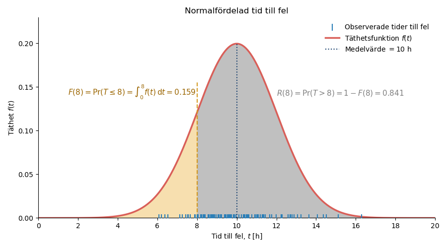
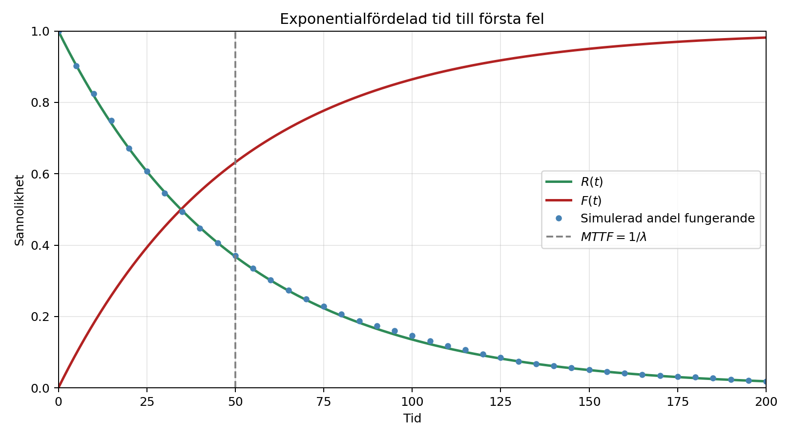

# Tillförlitlighetsanalys

Funktionssäkerhet (*reliability*) beskriver en enhets förmåga att utföra en krävd funktion under givna förhållanden och under ett angivet tidsintervall. 

Med **tillförlitlighetsanalys** avses de metoder som används för att beskriva och analysera fel och tider till fel.

Funktionssäkerhet är en del av driftsäkerheten och påverkar hur ofta en enhet tappar sin funktion. Reparationstider och väntetider påverkar däremot hur lång tid det tar innan enheten åter är funktionsduglig. Sambandet mellan dessa egenskaper beskrivs närmare på sidorna [Driftsäkerhet och RAMS](rams.qmd) och [Beräkning av tillgänglighet](tillganglighet.qmd).

## Icke-reparerbara och reparerbara enheter

En **icke-reparerbar enhet** kan inte återställas till funktionsdugligt skick efter ett fel. När felet inträffar har enheten nått sin livslängd och måste ersättas. Exempel är säkringar, glödlampor och vissa elektroniska komponenter. För sådana enheter studeras tiden från driftsättning till det första felet (*time to failure*, TTF). Medelvärdet av denna tid betecknas **MTTF** (*Mean Time To Failure*).

En **reparerbar enhet** kan återställas till funktionsdugligt skick efter ett fel genom reparation, exempelvis utbyte av felaktiga delar. Eftersom samma enhet kan drabbas av flera fel under sin livstid studeras tiden från återställningen efter ett fel till nästa fel (*time between failures*, TBF). Medelvärdet av denna tid betecknas **MTBF** (*Mean Time Between Failures*).

För en icke-reparerbar enhet studeras fördelningen för tiden till fel $T$.

För en reparerbar enhet kan analysen göras ur två perspektiv:

- Om varje reparation antas återställa enheten till *good as new* kan varje tid mellan fel behandlas som en ny tid till fel. Tiderna mellan fel bildar då en förnyelseprocess och kan beskrivas med samma typer av sannolikhetsfördelningar som tider till fel.
- Om syftet är att beskriva hur felhändelserna ackumuleras över tiden studeras i stället en felprocess. Antalet fel som har inträffat fram till tiden $t$ betecknas då $N(t)$, se [Felprocesser för reparerbara enheter](#felprocesser-for-reparerbara-enheter).

Sannolikhetsfördelningar används alltså för att beskriva enskilda tider till eller mellan fel, medan felprocesser används för att beskriva en följd av fel över tiden.

## Data för tillförlitlighetsanalys

En tillförlitlighetsanalys bygger på observerade tider till fel eller tider mellan fel. För observationerna behöver man även information om exempelvis driftsförhållanden och belastning, eftersom funktionssäkerheten gäller under givna förhållanden.

Om en enhet fortfarande fungerar när observationen avslutas känner man inte dess fullständiga tid till fel. Observationen är då **censurerad**.

## Ett diskret exempel med en tärning

För att illustrera hur slumpmässiga felhändelser beter sig börjar vi med ett diskret exempel. Anta att en enhets funktionstillstånd kontrolleras med jämna tidsintervall. Vid varje kontroll kastas en tiosidig tärning:

- utfallet $1$ betyder att enheten får ett fel,
- övriga utfall betyder att enheten fortsätter att fungera.

Sannolikheten för fel vid varje kontroll är

$$
p=\frac{1}{10}=0{,}1.
$$

Kasten är oberoende av varandra, och sannolikheten för fel är 10 procent vid varje kontroll så länge enheten fortfarande fungerar.

Låt $K$ beteckna antalet kast fram till och med det första felet. För att det första felet ska inträffa vid kast $k$ måste enheten klara de första $k-1$ kasten och därefter få ett fel vid kast $k$. Sannolikheten för detta är

$$
f_K(k)
=
P(K=k)
=
(1-p)^{k-1}p,
\qquad
k=1,2,\ldots
$$

Antalet kast fram till det första felet är därmed geometriskt fördelat.

### Funktionssannolikhet och felsannolikhet

För att enheten fortfarande ska fungera efter $k$ kast måste den ha klarat samtliga kast. Funktionssannolikheten är därför

$$
R_K(k)
=
P(K>k)
=
(1-p)^k.
$$

Felsannolikheten anger sannolikheten att det första felet har inträffat senast vid kast $k$:

$$
F_K(k)
=
P(K\leq k)
=
1-(1-p)^k.
$$

Funktionssannolikheten och felsannolikheten kompletterar varandra:

$$
F_K(k)=1-R_K(k).
$$

Sannolikheten att det första felet inträffar vid exakt kast $k$ är förändringen i den samlade felsannolikheten mellan kast $k-1$ och kast $k$:

$$
f_K(k)
=
F_K(k)-F_K(k-1)
=
\Delta F_K(k).
$$

Om sannolikheterna för fel vid varje enskilt kast summeras erhålls sannolikheten att ett fel har inträffat senast vid kast $k$:

$$
F_K(k)=\sum_{i=1}^{k}f_K(i).
$$

De tre funktionerna beskriver alltså olika saker:

- $R_K(k)$ är sannolikheten att enheten fortfarande fungerar efter $k$ kast.
- $F_K(k)$ är sannolikheten att enheten har fått sitt första fel senast vid kast $k$.
- $f_K(k)$ är sannolikheten att det första felet inträffar vid exakt kast $k$.

Före den första kontrollen, när $k=0$, fungerar enheten fortfarande. Därför är $R_K(0)=1$ och $F_K(0)=0$.

Felsannolikheten vid nästa kontroll är alltid 10 procent för en enhet som fortfarande fungerar. Sannolikheten $f_K(k)$ minskar ändå med antalet kast, eftersom färre enheter klarar sig tillräckligt länge för att få sitt första fel vid ett sent kast.

| Kast $k$ | $P(\text{tärningen visar 1})$ | $P(\text{tärningen inte visar 1})$ | $R_K(k)$ | $F_K(k)$ | $f_K(k)$ |
|---:|---:|---:|---:|---:|---:|
| 1 | 0,100 | 0,900 | 0,900 | 0,100 | 0,100 |
| 2 | 0,100 | 0,900 | 0,810 | 0,190 | 0,090 |
| 3 | 0,100 | 0,900 | 0,729 | 0,271 | 0,081 |
| 4 | 0,100 | 0,900 | 0,656 | 0,344 | 0,073 |
| 5 | 0,100 | 0,900 | 0,590 | 0,410 | 0,066 |
| 6 | 0,100 | 0,900 | 0,531 | 0,469 | 0,059 |
| 7 | 0,100 | 0,900 | 0,478 | 0,522 | 0,053 |
| 8 | 0,100 | 0,900 | 0,430 | 0,570 | 0,048 |
| 9 | 0,100 | 0,900 | 0,387 | 0,613 | 0,043 |
| 10 | 0,100 | 0,900 | 0,349 | 0,651 | 0,039 |
| $\ldots$ | $\ldots$ | $\ldots$ | $\ldots$ | $\ldots$ | $\ldots$ |
| 40 | 0,100 | 0,900 | 0,015 | 0,985 | 0,002 |

Det förväntade antalet kast fram till felet är

$$
\operatorname{E}[K]=\frac{1}{p}.
$$

För den tiosidiga tärningen är det förväntade antalet kast alltså tio. Det betyder inte att varje enhet får fel efter tio kast, utan att medelvärdet närmar sig tio när många likadana enheter observeras.

## Kontinuerlig tid till fel

I tärningsexemplet kan felet endast inträffa vid bestämda kontroller och tiden till fel mäts därför som ett antal kast. För en enhet som används kontinuerligt kan felet däremot inträffa när som helst. Tiden till fel beskrivs då med en kontinuerlig stokastisk variabel.

Låt $T$ beteckna tiden till fel för en enhet i en population av jämförbara enheter. Eftersom enheternas livslängder varierar modelleras $T$ som en stokastisk variabel. En observerad livslängd är en realisation av $T$.

Samma grundläggande funktioner används som i det diskreta exemplet. Skillnaden är att sannolikheten för fel vid ett enskilt kast ersätts av en täthetsfunktion över kontinuerlig tid.

En illustration av sambandet mellan täthetsfunktionen, fördelningsfunktionen och
funktionssannolikheten ges i avsnittet [Exempel med normalfördelning](#exempel-med-normalfordelning).

### Täthetsfunktion

Täthetsfunktionen $f(t)$, på engelska *probability density function* (PDF), beskriver hur sannolikheten för tiden till fel är fördelad över tiden.

För en kontinuerlig variabel är $f(t)$ en täthet och inte sannolikheten för fel vid en exakt tidpunkt. Sannolikheten att felet inträffar mellan tiderna $t_1$ och $t_2$ motsvarar arean under täthetsfunktionen:

$$
P(t_1<T\leq t_2)
=
\int_{t_1}^{t_2}f(t)\,dt.
$$

En täthetsfunktion är alltid icke-negativ och den sammanlagda arean under kurvan är 1:

$$
f(t)\geq 0
\qquad\text{och}\qquad
\int_{-\infty}^{\infty}f(t)\,dt=1.
$$

För en fördelning som endast beskriver icke-negativa tider gäller $f(t)=0$ när $t<0$. Integralen kan då skrivas

$$
\int_0^\infty f(t)\,dt=1.
$$

Vanliga fördelningar för tider till fel är exponential-, Weibull- och lognormalfördelningen.

### Felsannolikhet

Fördelningsfunktionen $F(t)$ anger sannolikheten att felet har inträffat senast vid tiden $t$:

$$
F(t)=P(T\leq t).
$$

För en kontinuerlig variabel erhålls fördelningsfunktionen genom att integrera täthetsfunktionen:

$$
F(t)
=
\int_{-\infty}^{t}f(u)\,du.
$$

För en fördelning som endast kan anta icke-negativa tider kan detta skrivas som

$$
F(t)
=
\int_0^t f(u)\,du.
$$

### Funktionssannolikhet och överlevnadsfunktion

Funktionssannolikheten $R(t)$ anger sannolikheten att enheten fortfarande fungerar efter tiden $t$:

$$
R(t)=P(T>t).
$$

Detta är samma funktion som ofta kallas för överlevnadsfunktion. I detta sammanhang är termerna alltså likvärdiga: $R(t)$ beskriver sannolikheten för att en enhet fortfarande fungerar vid tiden $t$.

Eftersom enheten antingen har fått ett fel senast vid tiden $t$ eller fortfarande fungerar gäller

$$
R(t)=1-F(t).
$$

För en population av jämförbara enheter anger $F(t)$ sannolikheten att en slumpmässigt vald enhet har fått fel senast vid tiden $t$. Den kan också tolkas som den förväntade andelen enheter som har fått fel. På motsvarande sätt anger $R(t)$ sannolikheten att enheten fortfarande fungerar och den förväntade andelen fungerande enheter.

### Förväntad tid till fel

För en icke-reparerbar enhet är MTTF väntevärdet av tiden till fel:

$$
MTTF
=
\operatorname{E}[T]
=
\int_0^\infty t f(t)\,dt
=
\int_0^\infty R(t)\,dt.
$$

För en reparerbar enhet definieras MTBF på motsvarande sätt som väntevärdet av tiden mellan fel. 

### Felintensitet

Felintensiteten $\lambda(t)$ beskriver hur snabbt fel uppstår vid tiden $t$ bland de enheter som fortfarande fungerar. På engelska benämns den *hazard function* eller *hazard rate*. Den ges av

$$
\lambda(t)
=
\frac{f(t)}{R(t)}.
$$

Felintensiteten är ett mått på den momentana felbenägenheten vid tiden $t$, givet att enheten har fungerat utan fel fram till denna tidpunkt. Den är därför ett villkorat intensitetsmått och inte en sannolikhet. Eftersom felintensiteten uttrycks per tidsenhet, exempelvis fel per drifttimme, kan dess värde vara större än 1.

### Exempel med normalfördelning

Normalfördelningen används här för att illustrera hur en täthetsfunktion, fördelningsfunktion och funktionssannolikhet ska tolkas. Anta att tiden till fel är normalfördelad med medelvärdet 10 timmar och standardavvikelsen 2 timmar:

$$
T\sim N(10,2^2).
$$

Täthetsfunktionens värde vid en viss tidpunkt är inte en sannolikhet, utan beskriver hur sannolikheten är fördelad över tiden. Sannolikheter erhålls som areor under täthetskurvan. 

Täthetsfunktionen är som högst vid medelvärdet, 10 timmar, vilket innebär att tiderna till fel är mest koncentrerade (tätast) omkring detta värde.

Den gula arean motsvarar sannolikheten att enheten har fått fel senast vid 8 timmar:

$$
F(8)
=
P(T\leq8)
=
\int_0^8 f(t)\,dt
\approx
0{,}159.
$$

Den återstående arean motsvarar sannolikheten att enheten fortfarande fungerar efter 8 timmar:

$$
R(8)
=
P(T>8)
=
\int_8^\infty f(t)\,dt
=
1-F(8)
\approx
0{,}841.
$$

Figuren visar därmed sambandet mellan täthetsfunktionen $f(t)$, fördelningsfunktionen $F(t)$ och funktionssannolikheten $R(t)$.

Normalfördelningen tillåter även negativa värden och är därför inte generellt lämplig för tider till fel. I detta exempel är sannolikheten för en negativ tid försumbar eftersom medelvärdet ligger fem standardavvikelser från noll.

## Exponentialfördelning

Exponentialfördelningen används när felintensiteten kan betraktas som konstant:

$$
\lambda(t)=\lambda.
$$

Det innebär att en enhet som har fungerat länge har samma felintensitet som en enhet som nyligen tagits i drift. Modellen är därför främst lämplig under perioder då fel uppträder slumpmässigt och varken inkörning eller åldrande har någon tydlig påverkan.

### Från diskret till kontinuerlig tid

Låt varje kast i det diskreta exemplet motsvara ett tidsintervall med längden $\Delta t$. Vid konstant felintensitet $\lambda$ kan sannolikheten för fel under intervallet skrivas som

$$
p=1-e^{-\lambda\Delta t}.
$$

För ett kort tidsintervall gäller approximationen

$$
p\approx\lambda\Delta t.
$$

När tidsintervallen görs allt kortare övergår den geometriska modellen i en kontinuerlig modell där tiden till fel är exponentialfördelad:

$$
T\sim\operatorname{Exp}(\lambda).
$$

### Fördelningens funktioner

För exponentialfördelningen gäller

$$
F(t)=1-e^{-\lambda t},
$$

$$
R(t)=e^{-\lambda t}
$$

och

$$
f(t)=\lambda e^{-\lambda t}.
$$

Medeltiden till fel är

$$
MTTF=\frac{1}{\lambda}.
$$

För en reparerbar enhet med exponentialfördelade tider mellan fel gäller på motsvarande sätt

$$
MTBF=\frac{1}{\lambda}.
$$

### Exempel: sannolikheten att en pump fungerar

Fem likadana, icke-reparerbara pumpar har följande observerade tider till fel:

$$
7,\ 15,\ 9,\ 3,\ 4\ \text{timmar}.
$$

Om samtliga tider är fullständigt observerade kan MTTF skattas med det aritmetiska medelvärdet:

$$
\widehat{MTTF}
=
\frac{7+15+9+3+4}{5}
=
7{,}6\ \text{h}.
$$

Om tiderna antas vara exponentialfördelade skattas felintensiteten som

$$
\hat{\lambda}
=
\frac{1}{7{,}6}
\approx
0{,}132\ \text{h}^{-1}.
$$

Den skattade sannolikheten att en pump fungerar längre än 5 timmar blir

$$
R(5)
=
e^{-5/7{,}6}
\approx
0{,}518.
$$

Under antagandet om exponentialfördelade tider till fel är sannolikheten alltså cirka **51,8 %**. Eftersom skattningen endast bygger på fem observationer är osäkerheten stor.

### Antaganden i pumpexemplet

Beräkningen i pumpexemplet bygger på att

- pumparna är icke-reparerbara och observeras till sitt första fel,
- pumparnas tider till fel är oberoende,
- tiderna kan beskrivas med samma exponentialfördelning,
- felintensiteten är konstant under den studerade perioden,
- ett inträffat fel kan observeras och klassificeras entydigt.

För reparerbara enheter kan exponentialfördelningen på motsvarande sätt användas för tider mellan fel, exempelvis under antagandet *good as new*.

## Weibullfördelning

Weibullfördelningen är mer flexibel än exponentialfördelningen eftersom felintensiteten kan minska, vara konstant eller öka med tiden. Fördelningen har skalparametern $\alpha$ och formparametern $\beta$.

Felsannolikheten och funktionssannolikheten ges av

$$
F(t)
=
1-\exp\left[-\left(\frac{t}{\alpha}\right)^\beta\right]
$$

och

$$
R(t)
=
\exp\left[-\left(\frac{t}{\alpha}\right)^\beta\right].
$$

Täthetsfunktionen är

$$
f(t)
=
\frac{\beta t^{\beta-1}}{\alpha^\beta}
\exp\left[-\left(\frac{t}{\alpha}\right)^\beta\right],
$$

och felintensiteten är

$$
\lambda(t)
=
\frac{\beta t^{\beta-1}}{\alpha^\beta}.
$$

Formparametern $\beta$ bestämmer hur felintensiteten förändras:

- $\beta<1$: felintensiteten minskar med tiden,
- $\beta=1$: felintensiteten är konstant och Weibullfördelningen övergår i exponentialfördelningen,
- $\beta>1$: felintensiteten ökar med tiden.

Medeltiden till fel ges av

$$
MTTF
=
\alpha\Gamma\left(1+\frac{1}{\beta}\right).
$$

För Weibullfördelade tider mellan fel används samma uttryck för MTBF. Värden på gammafunktionen och samtliga fördelningsfunktioner finns i [Formelsamling i drift och underhåll](formelsamling.qmd).

### Exempel: tonerkassett

Anta att tiden till fel för en tonerkassett är Weibullfördelad med $\alpha=16$ dygn och $\beta=6$. Sannolikheten att kassetten fungerar längre än 12 dygn är

$$
R(12)
=
\exp\left[-\left(\frac{12}{16}\right)^6\right]
\approx
0{,}837.
$$

Sannolikheten är alltså cirka **83,7 %**.

## Badkarskurvan

Badkarskurvan är en principiell beskrivning av hur felintensiteten för en population av jämförbara enheter kan variera med enheternas ålder. Kurvan erhålls genom att betrakta felutfallet för många enheter och inte genom att följa en enskild enhet. Den består av tre karakteristiska perioder:

1. **Begynnelseperiod:** Felintensiteten minskar med enheternas ålder. De fel som uppträder tidigt kan exempelvis bero på tillverkningsfel, installationsfel eller andra brister som inte upptäckts före driftsättning.
2. **Bästperiod:** Felintensiteten är ungefär konstant. Felen uppstår då huvudsakligen slumpmässigt och oberoende av enheternas ålder. Exponentialfördelningen kan i detta fall vara en lämplig modell.
3. **Slutperiod:** Felintensiteten ökar när komponenter åldras, förslits eller degraderas.

Alla populationer av enheter uppvisar inte en tydlig badkarskurva. Kurvan bör därför betraktas som en konceptuell modell för vanliga felmönster hos maskinkomponenter. Weibullfördelningens formparameter kan beskriva minskande, konstant eller ökande felintensitet. En enda Weibullfördelning beskriver däremot normalt inte badkarskurvans samtliga tre perioder.

## Val av sannolikhetsfördelning

Valet av fördelning ska grundas på hur enheten fungerar, hur den används och hur observerade data ser ut. Exponentialfördelningen är lämplig när felintensiteten är ungefär konstant. Weibullfördelningen kan även beskriva minskande och ökande felintensitet.

Normalfördelningen kan användas när tiderna är ungefär symmetriskt fördelade och variationen är liten i förhållande till medelvärdet. Eftersom normalfördelningen även tillåter negativa värden är den ofta mindre naturlig för tider till fel. Positiva och högerskeva tider beskrivs vanligen bättre med exempelvis Weibull- eller lognormalfördelning.

Fördelningsvalet bör kontrolleras mot data. En parameter som skattats från ett litet antal observationer ska alltid tolkas med försiktighet.

## Felprocesser för reparerbara enheter

För en reparerbar enhet kan flera fel inträffa under observationsperioden. Låt $N(t)$ beteckna antalet fel som har inträffat fram till tiden $t$. Hur felprocessen modelleras beror bland annat på vilket tillstånd enheten antas ha efter en reparation.

Tidsskalan behöver definieras för analysen. Tiden $t$ kan exempelvis avse ackumulerad drifttid eller kalendertid. Valet påverkar hur processintensiteten och tiderna mellan fel ska tolkas.

### Förnyelseprocess

Om varje reparation återställer enheten till ett skick som motsvarar en ny enhet, *good as new*, börjar en ny livslängd efter varje reparation. Tiderna mellan fel kan då betraktas som oberoende och likafördelade stokastiska variabler. Följden av fel och efterföljande återställningar bildar då en **förnyelseprocess**.

Tiderna mellan fel kan exempelvis vara exponential- eller Weibullfördelade. Om de är exponentialfördelade med konstant felintensitet erhålls en homogen Poissonprocess.

### Homogen Poissonprocess

I en **homogen Poissonprocess** (HPP) är processintensiteten (felintensiteten) konstant. Antalet fel under ett tidsintervall beror därför endast på intervallets längd och inte på enhetens ålder eller tidigare fel.

Om processens konstanta felintensitet är $\nu$ gäller

$$
N(t)\sim\operatorname{Poisson}(\nu t).
$$

Parameteren $\nu$ beskriver det förväntade antalet fel per tidsenhet.

Tiderna mellan fel är då oberoende och exponentialfördelade, och

$$
MTBF=\frac{1}{\nu}.
$$

### Icke-homogen Poissonprocess

I en **icke-homogen Poissonprocess** (NHPP) varierar felintensiteten med tiden. Modellen kan därför beskriva en reparerbar enhet vars felbenägenhet ökar på grund av degradering eller minskar till följd av förbättringar.

NHPP används ofta när reparationen återställer funktionen men inte gör enheten som ny, så kallad minimal reparation. Tiderna mellan fel är då inte likafördelade, och ett enda konstant värde på MTBF beskriver inte felprocessen fullständigt.

Om processintensiteten betecknas $\nu(t)$ är det förväntade antalet fel fram till tiden $t$

$$
\operatorname{E}[N(t)]
=
\int_0^t \nu(u)\,du.
$$

## Systemtillförlitlighet

Ett system består ofta av flera komponenter som samverkar. Systemets funktionssäkerhet beror både på komponenternas funktionssäkerhet och på hur de är kopplade.

Formlerna nedan förutsätter att komponenternas fel är oberoende. Gemensamma felorsaker, beroenden mellan komponenter och begränsad systemkapacitet behöver annars behandlas särskilt.

### Seriekopplat system

Ett system är seriekopplat ur funktionssynpunkt om samtliga komponenter måste fungera för att systemet ska kunna utföra sin krävda funktion. En drivlina bestående av turbin, generator och transformator kan exempelvis betraktas som ett seriekopplat system om ett fel i någon av komponenterna stoppar hela funktionen.

För ett system med $n$ oberoende komponenter gäller

$$
R_{tot}(t)
=
\prod_{i=1}^{n}R_i(t).
$$

Varje ytterligare komponent som måste fungera minskar systemets funktionssannolikhet.

### Parallellkopplat system

Ett system är parallellkopplat ur funktionssynpunkt om det räcker att minst en av komponenterna fungerar. För $n$ oberoende komponenter gäller

$$
R_{tot}(t)
=
1-
\prod_{i=1}^{n}\left[1-R_i(t)\right].
$$

Parallellkoppling kan ge redundans och därmed öka systemets funktionssäkerhet. Det måste dock vara tydligt om en enda fungerande komponent har tillräcklig kapacitet för att systemet ska kunna utföra sin krävda funktion. Även gemensamma felorsaker kan minska nyttan av redundansen.

Ett standby-system kräver dessutom antaganden om bland annat inkoppling, omkopplingstid och om reservkomponenten kan fela medan den väntar. Det kan därför inte alltid behandlas som ett vanligt parallellkopplat system.

### Blandat system

Ett blandat system innehåller både serie- och parallellkopplade delar. Analysen genomförs stegvis:

1. Identifiera vilka komponenter som måste fungera för att systemets krävda funktion ska kunna utföras.
2. Beräkna funktionssannolikheten för varje delsystem.
3. Kombinera delsystemen tills systemets totala funktionssannolikhet erhålls.

### Exempel: två krossar och en truck

Ett system består av två parallellkopplade krossar och en truck som är seriekopplad med krossarna. Minst en kross och trucken måste fungera för att systemet ska kunna utföra sin krävda funktion.

| Komponent | MTTF |
|---|---:|
| Kross 1 | 1 000 h |
| Kross 2 | 1 000 h |
| Truck | 200 h |

Anta att komponenterna har konstanta felintensiteter, att felen är oberoende och att ingen reparation genomförs under den studerade perioden på 50 timmar.

För en exponentialfördelad tid till fel gäller

$$
R(t)=e^{-t/MTTF}.
$$

Krossarnas funktionssannolikhet efter 50 timmar är

$$
R_{K1}(50)=R_{K2}(50)
=
e^{-50/1000}
\approx
0{,}9512.
$$

Truckens funktionssannolikhet är

$$
R_T(50)
=
e^{-50/200}
\approx
0{,}7788.
$$

De parallellkopplade krossarnas gemensamma funktionssannolikhet blir

$$
R_K(50)
=
1-\left[1-R_{K1}(50)\right]
\left[1-R_{K2}(50)\right]
\approx
0{,}9976.
$$

Krossdelen är seriekopplad med trucken. Systemets funktionssannolikhet blir därför

$$
R_{tot}(50)
=
R_K(50)R_T(50)
\approx
0{,}9976\cdot0{,}7788
\approx
0{,}7769.
$$

Sannolikheten att systemet fungerar utan fel under de 50 timmarna är alltså cirka **77,7 %**. De parallellkopplade krossarna har mycket hög gemensam funktionssannolikhet. Trucken har därför störst påverkan på systemets resultat.

## Sammanfattning

- MTTF används för tider till fel hos icke-reparerbara enheter och MTBF för tider mellan fel hos reparerbara enheter.
- $F(t)$ beskriver sannolikheten att fel har inträffat, medan $R(t)$ beskriver sannolikheten att enheten fortfarande fungerar.
- Exponentialfördelningen förutsätter konstant felintensitet.
- Weibullfördelningen kan beskriva minskande, konstant eller ökande felintensitet.
- Upprepade fel i reparerbara enheter kan modelleras med en förnyelseprocess, HPP eller NHPP beroende på hur enheten påverkas av reparationerna och hur felintensiteten utvecklas.
- Systemets funktionssäkerhet beror både på komponenterna och på hur de är kopplade.
- Serie- och parallellformlerna förutsätter oberoende fel om inga beroenden modelleras separat.
